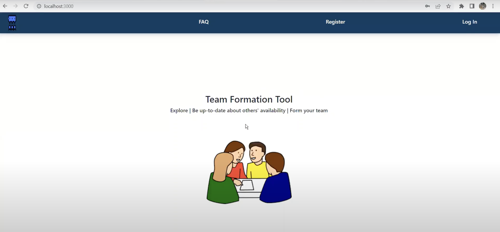

## CSC 510 Project 1 - Group 33
# Team Formation Tool 

## Documentation

Swagger Docs are accessible once the API is running. If you do not have it running, an alternative README with API specification is accessible via the "Read Documentation" button below.

## About

Team formation tool is an easy-to-use web-app that assists you to form teams efficiently. 

## Our Functionality
- Users can register as free agents, or partial/complete groups
- Free agents can request, or be requested, to join partial groups
- Users can list skills, interests, contact methods, etc

## Our Value
- Streamlines the process of group-forming, especially for distance education
    - No more checking to see if someone you know is in a group or not
    - No more emailing and waiting to see if a group has space for you or not
- Allows for the formation of groups with better-aligned skills and interests
    - Partial groups can find free agents with skills the group needs
    - Free agents can find groups whose skills they can work well with

## Installation

Please check [INSTALL.md](INSTALL.md) for instructions on how to install this package. 

## Unit tests

- Our test engine that automatically runs all files under the test directory with pattern test_* and runs all methods within them with pattern test_* and outputs the results.

- Please check [README.md](tests/README.md) in the test folder for instructions on how to run the test cases manually
## Test case output 

## Code Coverage

Coverage reported in Github Actions log 

## Support

If users need any support with the product, email rpmertz@ncsu.edu

## Funding

This project is not funded

## Roadmap

Can be found [here](https://github.com/users/mkudith/projects/1/views/1)
